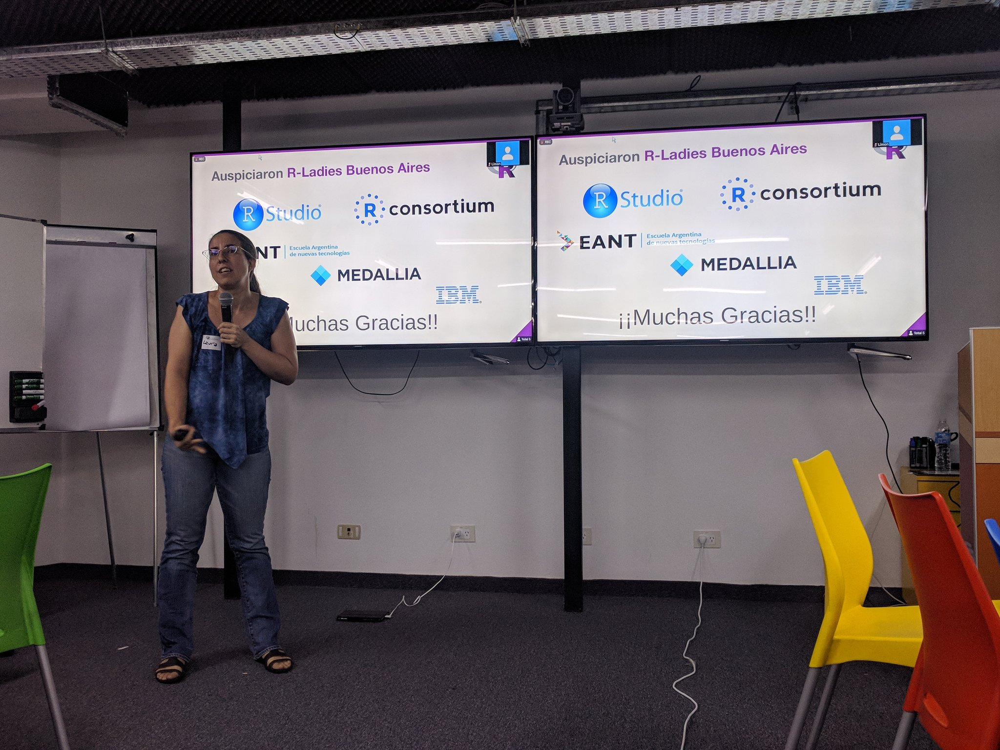
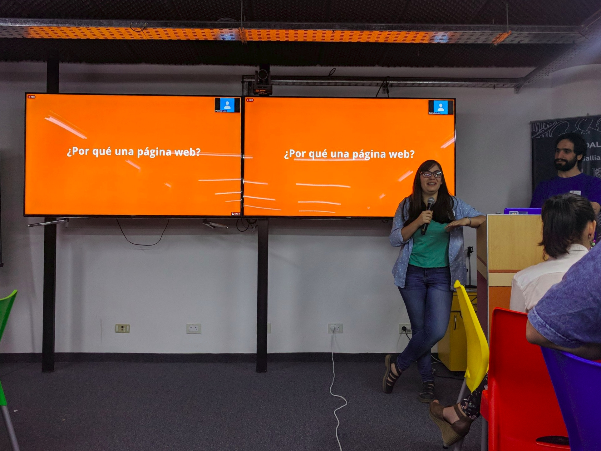

**El martes 3 de diciembre tuvimos nuestro primer encuentro**, que también fue el último encuentro de [R-Ladies Buenos Aires](https://twitter.com/rladiesba). Estamos muy contentos con la excelente convocatoria y gracias a todes por haber venido!

](taller-blogdown1.jpg) 

Primero, [Laura Ación](https://twitter.com/_lacion_) hizo un resumen de todas las actividades y logros de R-Ladies Buenos Aires.

 

Después, [Diego Kozlowski](https://twitter.com/Diego_Koz) presentó R en Buenos Aires y [Victoria ODonnell](https://twitter.com/victoriaodon) hizo un tour por [nuestro Slack](/slack) para que los que nunca lo usaron se sientan como en casa.

](taller-blogdown3.jpg)

Finalmente, [Paola Corrales](https://twitter.com/paobcorrales) y [Elio Campitelli](https://twitter.com/d_olivaw) lideraron un taller de blogdown. Remando los inevitables problemas técnicos entre todes, les asistentes se llevaron el know-how para hacer su propio sitio web con R. 

 

Para quienes no hayan podido ir, el video de todo el encuentro está [disponible en youtube](https://www.youtube.com/watch?v=MvaG8sC8Me0) y los materiales para seguir el taller, en [este repositorio](https://github.com/renbaires/encuentros/tree/master/2018-12-03_Taller-Blogdown).

<iframe width="560" height="315" src="https://www.youtube.com/embed/MvaG8sC8Me0?si=90hcVMvnOZ-lA-OP" title="YouTube video player" frameborder="0" allow="accelerometer; autoplay; clipboard-write; encrypted-media; gyroscope; picture-in-picture; web-share" referrerpolicy="strict-origin-when-cross-origin" allowfullscreen></iframe>

> Gracias a los genios de [Medallia](http://www.medallia.com.ar/) por brindarnos el espacio y una picada increíble.
