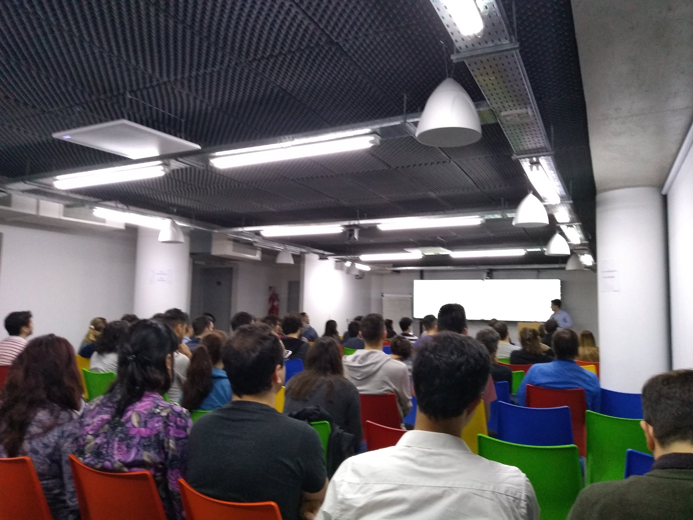
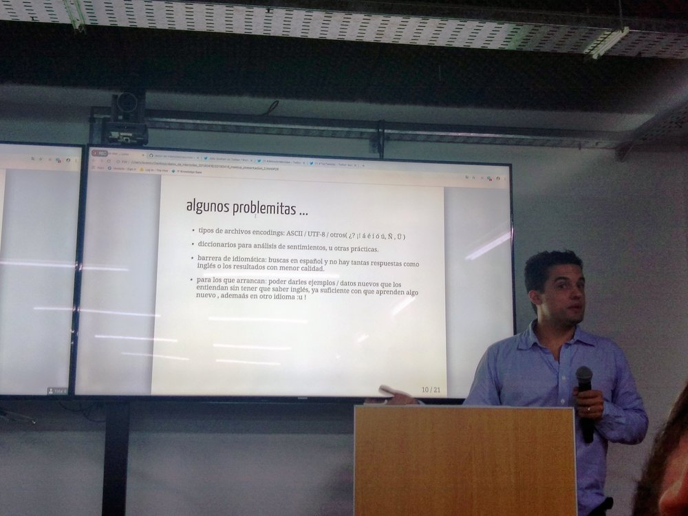
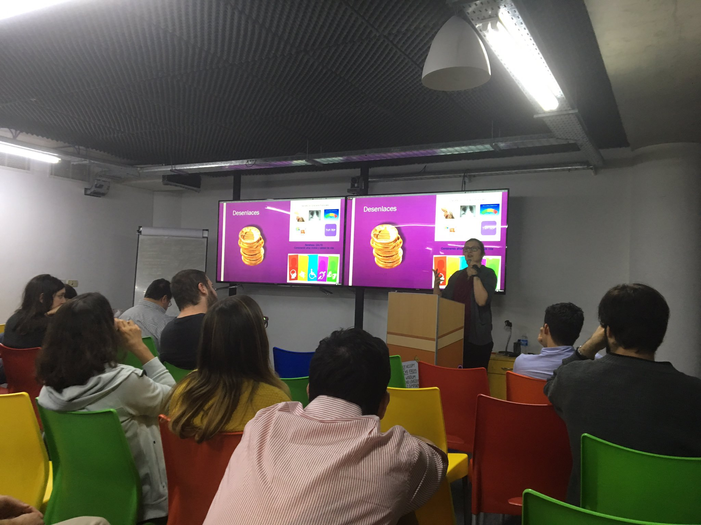

¿Qué mejor que el mes de abril para abrir con el primer encuentro del año? Antes de salir a comprar las roscas de pascua, organizamos un meetup donde tuvimos el lujo de presentar una nueva iniciativa de la comundiad de R y una charla interesantísima sobre la experiencia de usar R en un ámbito lleno de excel-lovers. Gracias a todes por haber venido!

 Salón lleno en Medallia. Foto gracias a [Guada](https://twitter.com/guadag12/status/1118280731434868737)

La primer charla estuvo a cargo de [Julio Spairani](https://twitter.com/jspairani), quién presentó [#DatosDeMiércoles](https://twitter.com/hashtag/DatosDeMiercoles). Es la versión en español de #TidyTuesday y es un espacio para practicar análisis de datos entre todes.

> Julio Spairani presenta #DatosDeMiércoles. "Dejá de ser acumulador o amarrete y empezá a compartir"

En la segunda charla, [Natalie Soto](https://twitter.com/ClaireNS) contó su historia de aplicación de R en la toma de decisiones en salud, donde la herramienta principal ¡es Excel 😱️! ¿Cómo hacer para evangelizar R en un lugar lleno de excel? "Hay que usarlo cuando uno tiene la oportunidad de usarlo. Ayuda mostrar los resultados. Ahora es indiscutible que hay que usar R".

Natalie Soto explica cómo se evalúan económicamente las intervenciones en salud. Foto gracias a [Marilina](https://twitter.com/SanteroMarilina/status/1118298249218220032)

Si te lo perdiste en vivo, el video de todas las charlas está [en youtube](https://www.youtube.com/watch?v=PXgY_kFQTsI).

<iframe width="560" height="315" src="https://www.youtube.com/embed/PXgY_kFQTsI?si=6beh_WTzmqt-dKXl" title="YouTube video player" frameborder="0" allow="accelerometer; autoplay; clipboard-write; encrypted-media; gyroscope; picture-in-picture; web-share" referrerpolicy="strict-origin-when-cross-origin" allowfullscreen>

</iframe>

> Como siempre, gracias a los genios de [Medallia](http://www.medallia.com.ar/) por brindarnos el espacio y una picada increíble.
