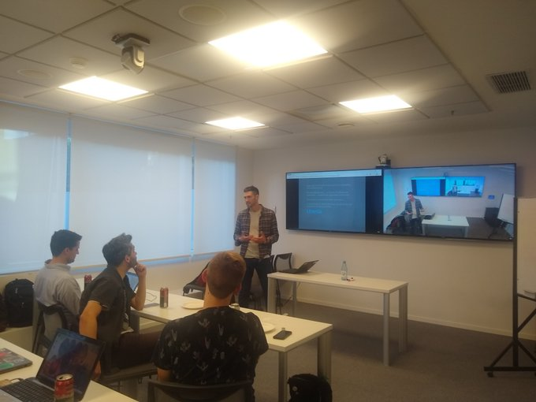
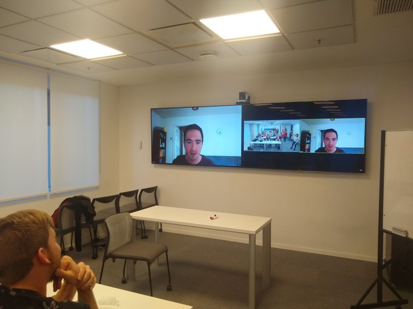
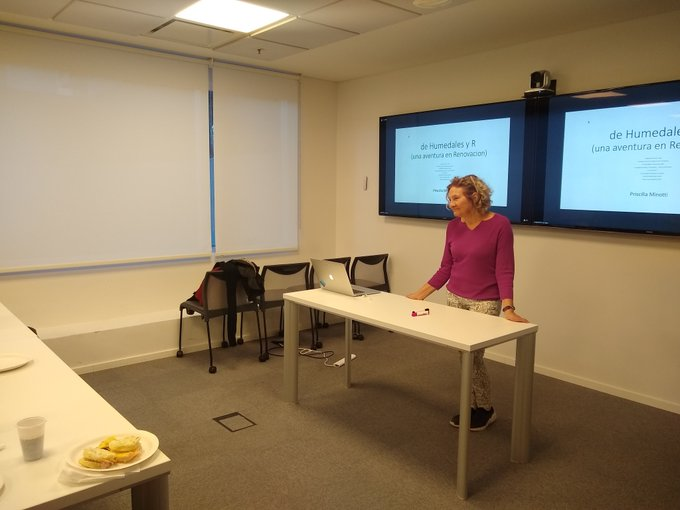

En R en Buenos Aires celebramos Halloween con un encuentro espectacular.

Primero, [Mauro Lepore](https://twitter.com/mauro_lepore) nos compartió un flujo de trabajo súper sencillo para colaborar con el código de otras personas, ya sean paquetes de R que usás, o análisis de datos colaborativos. **Moraleja: aprender usethis.**

Mauro nos enseñó a usar usethis para contribuir al código de otras personas usando git. Pueden encontrar todos los materiales de su charla en [este documento](https://github.com/an-org/datos-de-miercoles/blob/master/README.md), inluyendo la presentación, el código y un video paso a paso.

Tuvimos un interludio en el cual saludamos a [Pachá](https://twitter.com/pachamaltese) por teleconferencia. Por la delicada situación de Chile, lamentablemente no pudo estar presente en carne y hueso.

Finalmente, [Priscilla Minoti](https://www.twitter.com/pmnatural) presentó su trabajo detectando humedales a partir de preidictores espaciales. Es una historia que abarcó más de 10 años de código, versiones de R y código abierto.

Si te lo perdiste en vivo, el video de todas las charlas está [en youtube](https://www.youtube.com/watch?v=txJqi4vEIOY).

<iframe width="560" height="315" src="https://www.youtube.com/embed/txJqi4vEIOY?si=J-_P1o1-pemnLvJ4" title="YouTube video player" frameborder="0" allow="accelerometer; autoplay; clipboard-write; encrypted-media; gyroscope; picture-in-picture; web-share" referrerpolicy="strict-origin-when-cross-origin" allowfullscreen>

</iframe>

> Como siempre, gracias a los genios de [Medallia](http://www.medallia.com.ar/) por brindarnos el espacio y una picada increíble.
