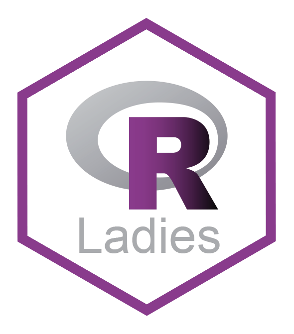
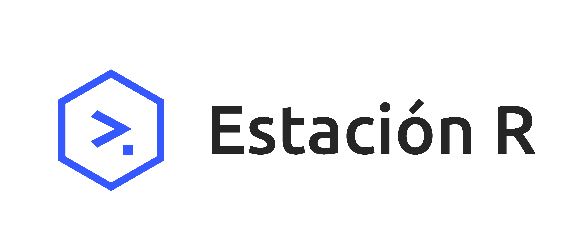

## Comunidades amigas

::: {.columns}

::: {.column width="50%"}

[🔗 R-Ladies Buenos Aires](https://github.com/RLadies-BA)

{width="60%"}

:::

::: {.column width="50%"}

[🔗 R-Ladies Santa Rosa](https://www.meetup.com/rladies-santa-rosa/A)

{width="50%"}

:::
:::

::: {.columns}

::: {.column width="33%"}

[🔗 LatinR](https://github.com/LatinR)

{width="60%"}

:::

::: {.column width="50%"}

:::

::: 

 
 

## Organizaciones e Instituciones que nos apoyan

::: {.columns}

::: {.column width="50%"}
[🔗 rOpenSci](https://ropensci.org/)

{width="50%"}

:::

::: {.column width="50%"}
[🔗 Nucleo de Innovación Social - NIS](https://nucleodeinnovacionsocial.com.ar/)

{width="50%"}

:::

:::

::: {.columns}

::: {.column width="50%"}
[🔗 Estación R](https://ropensci.org/)

{width="90%"}

:::

::: {.column width="50%"}

[🔗 Universidad de Flores](https://www.uflouniversidad.edu.ar/)

 

{width="60%"}

:::

:::

::: {.columns}

::: {.column width="100%"}
[🔗 Universidad Nacional de la Matanza - Biblioteca Leopoldo Marechal - UNLAM ](https://www.unlam.edu.ar/)

 

{width="30%"} 

:::

:::
